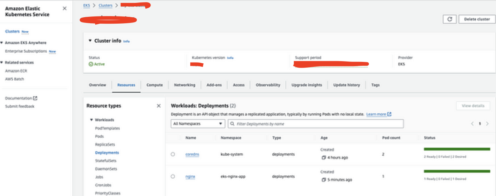
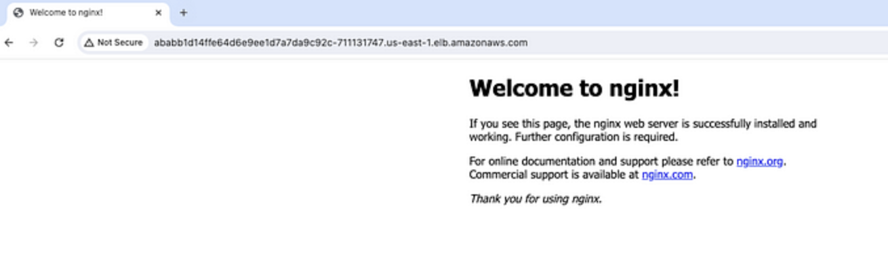

# Deploying EKS Cluster and Application with CI/CD using Jenkins and Terraform


## A Step-by-Step Guide to Automating Application Delivery with Jenkins and Terraform

Are you looking to optimize your application delivery and automate infrastructure deployment? This project is for you! I'll guide you through setting up an EKS cluster, deploying an application, and building a CI/CD pipeline using Jenkins and Terraform.  

We'll start with the fundamentals and progressively explore more technical aspects, making this guide useful for both beginners and experienced DevOps engineers. By the end, you'll have a fully operational EKS cluster, a deployed containerized application, and an automated CI/CD pipeline handling the entire process from code to production.


### Let's dive into EKS, CI/CD, and automation! 🚀  

### **Project Overview**  

In this project, we’ll build and deploy several key components. Here’s the roadmap:  

**I. Setting Up a Jenkins Server with Terraform**  
* Provisioning an EC2 instance using Terraform.  
* Installing essential tools: `Java, Jenkins, AWS CLI, Terraform CLI, Docker, Sonar, Helm, Trivy, Kubectl`.  
* Configuring the Jenkins server for CI/CD workflows.  

**II. Creating an EKS Cluster with Terraform**  
* Writing Terraform configurations for deploying an `EKS` cluster within a private subnet.  
* Using Terraform to launch and manage the `EKS` cluster.  

**III. Deploying an NGINX Application on Kubernetes**  
* Creating Kubernetes manifest files `(YAML)` for the `NGINX` application.  
* Deploying the application to the `EKS` cluster.  

**IV. Automating Deployment with Jenkins CI/CD**
* Setting up a `Jenkins` pipeline to automate EKS cluster creation and NGINX application deployment.  
* Integrating Terraform and Kubernetes within the Jenkins pipeline.  
* Configuring continuous integration and deployment (CI/CD) for seamless automation.  

### **Tools & Technologies Required**  

To successfully implement this CI/CD workflow, we’ll need the following:  

- **Terraform** – For defining infrastructure as code (IaC) to provision an EC2 instance (Jenkins server) and an EKS cluster within a VPC.  
- **Shell Script** – To install required CLI tools on the EC2 instance.  
- **Jenkinsfile** – To define and automate the pipeline in Jenkins.  
- **Kubernetes Manifest Files** – To deploy a simple NGINX application in the EKS cluster.  

### **Prerequisites**  

Before we begin, let's ensure we have the necessary development tools in place:  

1. **IDE for Development** – It’s recommended to use an IDE for writing and managing your code. I’ll be using `Visual Studio Code`, but feel free to use your preferred editor. You can download VS Code from: [Visual Studio Code Download](https://code.visualstudio.com/download).  

2. **Install CLI Tools** – Ensure you have the following command-line tools installed:  
   - [**AWS CLI**](https://docs.aws.amazon.com/cli/latest/userguide/getting-started-install.html)  
   - [**Terraform CLI**](https://developer.hashicorp.com/terraform/tutorials/aws-get-started/install-cli)  

3. **AWS Account Setup** – You’ll need an AWS Free Tier account.  
   - Create a user in the IAM Console.  
   - Generate an `Access Key ID` and `Secret Access Key` for that user.  
   - Download the credentials and export them to your terminal using:  

   ```bash
   export AWS_ACCESS_KEY_ID=<Your Access Key ID>
   export AWS_SECRET_ACCESS_KEY=<Your Secret Access Key>
   ```  

With these prerequisites in place, we’re ready to dive into the project! 🚀

### **Stage 1: Setting Up and Configuring the Jenkins Server**  

To begin, we need to generate a new key pair for accessing the EC2 instance and create an S3 bucket for storing Terraform state files. This is the only manual step in the process.  

#### **Creating a Key Pair**  
1. Navigate to the AWS Management Console.  
2. Open the "`EC2`" service and select "`Key Pairs`" from the sidebar.  
3. Click "`Create Key Pair`" at the top-right corner.  
4. Download the key pair, as it will be required later for logging into the EC2 instance.  

#### **Creating an S3 Bucket for Terraform State**  
Since Terraform requires an existing S3 bucket for remote state storage, we must create one manually before proceeding. Although Terraform can create an S3 bucket, it must exist before being referenced as a `remote backend`.  

1. Go to the AWS Management Console and open the `S3` service.  
2. Click "`Create Bucket`" and name it something unique, such as `terraform-eks-cicd-0987` (appending random numbers to ensure uniqueness).  


#### **Provisioning the EC2 Instance with Terraform**  
Now, we will define Terraform configuration files to create the EC2 instance, which will serve as the Jenkins server. Once provisioned, we will use a startup script to install essential tools like Jenkins.  

Below are the Terraform configuration files:  

> *backend.tf*

```yaml
terraform {
  backend "s3" {
    bucket = "terraform-eks-cicd-0987"
    key    = "jenkins/terraform.tfstate"
    region = "us-east-1"
  }
}
```

> *data.tf*

```yaml
data "aws_availability_zones" "azs" {}

# Get latest Amazon Linux AMI
data "aws_ami" "amazon-linux" {
  most_recent = true
  owners      = ["amazon"]
  filter {
    name   = "name"
    values = ["amzn2-ami-*-x86_64-gp2"]
  }
  filter {
    name   = "virtualization-type"
    values = ["hvm"]
  }
}
```

> *main.tf*

```yaml
# We will utilize publicly available modules to provision various services rather than defining individual resources.
# https://registry.terraform.io/browse/modules?provider=aws

# Creating a VPC
module "vpc" {
  source = "terraform-aws-modules/vpc/aws"

  name = var.vpc_name
  cidr = var.vpc_cidr

  azs            = data.aws_availability_zones.azs.names
  public_subnets = var.public_subnets
  map_public_ip_on_launch = true

  enable_dns_hostnames = true

  tags = {
    Name        = var.vpc_name
    Terraform   = "true"
    Environment = "dev"
  }

  public_subnet_tags = {
    Name = "jenkins-subnet"
  }
}

# SG
module "sg" {
  source = "terraform-aws-modules/security-group/aws"

  name        = var.jenkins_security_group
  description = "Security Group for Jenkins Server"
  vpc_id      = module.vpc.vpc_id

  ingress_with_cidr_blocks = [
    {
      from_port   = 8080
      to_port     = 8080
      protocol    = "tcp"
      description = "JenkinsPort"
      cidr_blocks = "0.0.0.0/0"
    },
    {
      from_port   = 443
      to_port     = 443
      protocol    = "tcp"
      description = "HTTPS"
      cidr_blocks = "0.0.0.0/0"
    },
    {
      from_port   = 80
      to_port     = 80
      protocol    = "tcp"
      description = "HTTP"
      cidr_blocks = "0.0.0.0/0"
    },
    {
      from_port   = 22
      to_port     = 22
      protocol    = "tcp"
      description = "SSH"
      cidr_blocks = "0.0.0.0/0"
    },
    {
      from_port   = 9000
      to_port     = 9000
      protocol    = "tcp"
      description = "SonarQubePort"
      cidr_blocks = "0.0.0.0/0"
    }
  ]

  egress_with_cidr_blocks = [
    {
      from_port   = 0
      to_port     = 0
      protocol    = "-1"
      cidr_blocks = "0.0.0.0/0"
    }
  ]

  tags = {
    Name = "jenkins-sg"
  }
}

# EC2
module "ec2_instance" {
  source = "terraform-aws-modules/ec2-instance/aws"

  name = var.jenkins_ec2_instance

  instance_type               = var.instance_type
  ami                         = "ami-0e8a34246278c21e4"
  key_name                    = "jenkins_server_keypair"
  monitoring                  = true
  vpc_security_group_ids      = [module.sg.security_group_id]
  subnet_id                   = module.vpc.public_subnets[0]
  associate_public_ip_address = true
  user_data                   = file("../scripts/install_build_tools.sh")
  availability_zone           = data.aws_availability_zones.azs.names[0]

  tags = {
    Name        = "Jenkins-Server"
    Terraform   = "true"
    Environment = "dev"
  }
}
```

> *install\_build\_tools.sh*

```shell
#!/bin/bash

# Ref - https://www.jenkins.io/doc/book/installing/linux/
# Installing jenkins
sudo yum install wget -y
sudo wget -O /etc/yum.repos.d/jenkins.repo \
    https://pkg.jenkins.io/redhat/jenkins.repo
sudo rpm --import https://pkg.jenkins.io/redhat/jenkins.io-2023.key
sudo yum upgrade -y
# Add required dependencies for the jenkins package
sudo yum install java-17-amazon-corretto-devel -y
sudo yum install jenkins -y
sudo systemctl daemon-reload

# Starting Jenkins
sudo systemctl enable jenkins
sudo systemctl start jenkins
sudo systemctl status jenkins

# Ref - https://www.atlassian.com/git/tutorials/install-git
# Installing git
sudo yum install -y git
git --version

# Installing Docker 
# Ref - https://www.cyberciti.biz/faq/how-to-install-docker-on-amazon-linux-2/
sudo yum update
sudo yum install docker -y

sudo usermod -a -G docker ec2-user
sudo usermod -aG docker jenkins

# Add group membership for the default ec2-user so you can run all docker commands without using the sudo command:
id ec2-user
newgrp docker

sudo systemctl enable docker.service
sudo systemctl start docker.service
sudo systemctl status docker.service

sudo chmod 777 /var/run/docker.sock

# Run Docker Container of Sonarqube
docker run -d  --name sonar -p 9000:9000 sonarqube:lts-community

# Installing AWS CLI
curl "https://awscli.amazonaws.com/awscli-exe-linux-x86_64.zip" -o "awscliv2.zip"
sudo apt install unzip -y
unzip awscliv2.zip
sudo ./aws/install

# Ref - https://developer.hashicorp.com/terraform/cli/install/yum
# Installing terraform
sudo yum install -y yum-utils
sudo yum-config-manager --add-repo https://rpm.releases.hashicorp.com/AmazonLinux/hashicorp.repo
sudo yum -y install terraform

# Ref - https://pwittrock.github.io/docs/tasks/tools/install-kubectl/
# Installing kubectl
sudo curl -LO https://storage.googleapis.com/kubernetes-release/release/v1.23.6/bin/linux/amd64/kubectl
sudo chmod +x ./kubectl
sudo mkdir -p $HOME/bin && sudo cp ./kubectl $HOME/bin/kubectl && export PATH=$PATH:$HOME/bin

# Installing Trivy
# Ref - https://aquasecurity.github.io/trivy-repo/
sudo tee /etc/yum.repos.d/trivy.repo << 'EOF'
[trivy]
name=Trivy repository
baseurl=https://aquasecurity.github.io/trivy-repo/rpm/releases/$basearch/
gpgcheck=1
enabled=1
gpgkey=https://aquasecurity.github.io/trivy-repo/rpm/public.key
EOF

sudo yum -y update
sudo yum -y install trivy

# Intalling Helm
# Ref - https://helm.sh/docs/intro/install/
curl -fsSL -o get_helm.sh https://raw.githubusercontent.com/helm/helm/main/scripts/get-helm-3
chmod 700 get_helm.sh
./get_helm.sh
```

Before running `terraform apply`, please keep the following points in mind:  

- Ensure that the correct key pair name is used in the EC2 instance module (`main.tf`), and it must exist before creating the instance.  
- Verify that the correct S3 bucket name is specified in the `remote` backend configuration (`backend.tf`).  
- In the EC2 module, include `user_data = file("../scripts/install_build_tools.sh")` to execute the script after the instance is created.  

Now, let's run `terraform apply` to create the resources. If this is your first time running Terraform, be sure to execute `terraform init` beforehand. Also, double-check that you are in the correct working directory before running Terraform CLI commands.

```yaml
(Naveens-MBP:Github naveen) $  pwd                                                                               
/Users/naveen/Github
(Naveens-MBP:Github naveen) $  cd jenkins_server                                                                
(Naveens-MBP:Github naveen) jenkins_server  $  cd tf-aws-ec2                                                                    
(Naveens-MBP:Github naveen) tf-aws-ec2  $  pwd                                                                                
/Users/naveen/Github/jenkins_server/tf-aws-ec2
(Naveens-MBP:Github naveen) tf-aws-ec2  $  export AWS_ACCESS_KEY_ID=xxxxx                                   
export AWS_SECRET_ACCESS_KEY=xxxxxx
(Naveens-MBP:Github naveen) tf-aws-ec2  $  terraform apply -var-file=variables/dev.tfvars -auto-approve    
```

terraform apply


Allow some time before checking the instance status in the AWS `EC2 console`. Even if the instance appears to be running, it may still be in the process of installing the necessary tools.


### Jenkins Build Server Successfully Created  

Now, let's log in to the Jenkins server and verify that all required tools have been installed correctly.  

To do this, select the `EC2 instance`, navigate to the **Connect** option, and copy the SSH command to access the server.


ssh commands to log in to EC2 instance

Next, go to your terminal, and paste the `ssh commands`. But before this make sure you have the keypair file downloaded in your workstation.

```yaml
(Naveens-MBP:Github naveen) $  pwd
/Users/naveen/Github
(Naveens-MBP:Github naveen) $ cd ~/Downloads/
(Naveens-MBP:Downloads naveen$ pwd
/Users/naveen/Downloads
(Naveens-MBP:Downloads naveen) $
(Naveens-MBP:Downloads naveen) $ ls -lrth | grep jenkins_server_keypair.pem
-r--------@   1 naveen  staff     0B Jan  1 20:59 jenkins_server_keypair.pem

(Naveens-MBP:Github naveen) $  ssh -i jenkins_server_keypair.pem ec2-user@42.209.142.28


   ,     #_
   ~\_  ####_        Amazon Linux 2024
  ~~  \_#####\
  ~~     \###|
  ~~       \#/ ___   https://aws.amazon.com/linux/amazon-linux-2024
   ~~       V~' '->
    ~~~         /
      ~~._.   _/
         _/ _/
       _/m/'
[ec2-user@ip-10-0-1-142 ~$]
```

Successfully connected to the EC2 instance!  

Now, we can verify the installed tool versions. Simply copy and execute the following commands.

```yaml
jenkins --version
docker --version
docker ps
terraform --version
kubectl version
aws --version
trivy --version
helm version
```

Here is the output.

```yaml
[ec2-user@ip-10-0-1-142 ~$] jenkins --version
2.448
[ec2-user@ip-10-0-1-142 ~$] docker --version
Docker version 20.10.25, build b82b9f3

[ec2-user@ip-10-0-1-142 ~$] docker ps
CONTAINER ID   IMAGE                   COMMAND                   CREATED          STATUS          PORTS                                      NAMES
be1c5d2a0f85   sonarqube:lts-community "/opt/sonarqube/dock..."  20 minutes ago   Up 20 minutes   0.0.0.0:9090->9090/tcp, :::9000->9000/tcp  sonar

[ec2-user@ip-10-0-1-142 ~$] terraform version
Terraform v1.9.5
on linux_amd64

[ec2-user@ip-10-0-1-142 ~$] kubectl version
Client Version: v1.30.2-eks-1552ad0

[ec2-user@ip-10-0-1-142 ~$] aws --version
aws-cli/2.17.52 Python/3.12.6 Linux/6.8.0-1012-aws exe/x86_64.amzn.2 prompt/off

[ec2-user@ip-10-0-1-142 ~$] trivy --version
Version: 0.49.1

[ec2-user@ip-10-0-1-142 ~$] helm version
version.BuildInfo{Version:"v3.14.2", GitCommit:"301108edc7ac2a8ba79e4ebf5701b0b6ce6a31e4", GitTreeState:"clean", GoVersion:"go1.21.7"}
```

To set up Jenkins, log in to the **EC2 instance** and copy its **public IP address**. Open a browser and enter the IP address followed by the port `8080` (e.g., `http://<EC2-Public-IP>:8080`). Ensure that port `8080` is allowed in the security group settings for Jenkins to access the instance.


Now, copy the administrator password from the below path and paste and continue.
```yaml
[ec2-user@ip-10-0-1-142 ~$] sudo cat /var/lib/jenkins/secrets/initialAdminPassword
75f976f09hsku6255s99854bbcv2738d299
[ec2-user@ip-10-0-1-142 ~$]
```

Copy the Admin password

You will get the below screen. Click on `Install Suggested Plugins`**.**


Install Suggested Plugin


Plugin Installing

Once all the plugins are installed, you will be presented with the following screen. Here, you can continue as an admin (click on `skip and continue as admin`) **or** create a new user and password then click `Save and Continue`.

Click on `Save and Finish` and then on the next page `Start using Jenkins.`


Finally, you will get the below **Jenkins Dashboard**. At this point, we are ready with our Jenkins server. We'll configure the pipeline later.


### Jenkins Dashboard

### **Stage 2: Creating Terraform Configuration Files for the EKS Cluster**

#### **Task 1: Write Terraform Configuration Files**

Next, we'll begin writing the Terraform configuration files for the `EKS` `cluster`, which will be deployed in a `private` `subnet`.

We will use the same bucket, but with a different key or folder for storing the `terraform remote state` file.

> *backend.tf*

```yaml
terraform {
  backend "s3" {
    bucket = "terraform-eks-cicd-0987"
    key    = "eks/terraform.tfstate"
    region = "us-east-1"
  }
}
```

> *vpc.tf*

```yaml
# We'll be using publicly available modules for creating different services instead of resources
# https://registry.terraform.io/browse/modules?provider=aws

# Creating a VPC
module "vpc" {
  source = "terraform-aws-modules/vpc/aws"

  name = var.vpc_name
  cidr = var.vpc_cidr

  azs            = data.aws_availability_zones.azs.names
  public_subnets = var.public_subnets
  private_subnets = var.private_subnets


  enable_dns_hostnames = true
  enable_nat_gateway = true
  single_nat_gateway = true

  tags = {
    "kubernetes.io/cluster/my-eks-cluster" = "shared"
    Terraform   = "true"
    Environment = "dev"
  }

  public_subnet_tags = {
    "kubernetes.io/cluster/my-eks-cluster" = "shared"
    "kubernetes.io/role/elb" = 1
  }

  private_subnet_tags = {
    "kubernetes.io/cluster/my-eks-cluster" = "shared"
    "kubernetes.io/role/internal-elb" = 1
  }
}
```

> *eks.tf*

```yaml
# Ref - https://registry.terraform.io/modules/terraform-aws-modules/eks/aws/latest

module "eks" {
  source  = "terraform-aws-modules/eks/aws"
  version = "~> 20.0"

  cluster_name    = "my-eks-cluster"
  cluster_version = "1.31"

  cluster_endpoint_public_access  = true

  vpc_id                   = module.vpc.vpc_id
  subnet_ids               = module.vpc.private_subnets


  eks_managed_node_groups = {
    nodes = {
      min_size     = 1
      max_size     = 3
      desired_size = 2

      instance_types = ["t2.small"]
      capacity_type  = "SPOT"
    }
  }

  tags = {
    Environment = "dev"
    Terraform   = "true"
  }
}
```

Please make a note that we are using a `private subnet` for our `EKS` `cluster` as we don't want it to be publicly accessed.

> *dev.tfvars*

```yaml
Copyaws_region = "us-east-1"
aws_account_id = "12345678"
vpc_name       = "eks-vpc"
vpc_cidr       = "192.168.0.0/16"
public_subnets = ["192.168.1.0/24", "192.168.2.0/24", "192.168.3.0/24"]
private_subnets = ["192.168.4.0/24", "192.168.5.0/24", "192.168.6.0/24"]
instance_type  = "t2.small"
```

#### **Task 2: Validate the Terraform Configuration Files**

Before we create the AWS EKS infrastructure through the Jenkins pipeline, we need to validate the configuration files we created in the previous step.

To do this, let's move the `tf-aws-eks` directory, initialize the working directory, and then run `terraform plan`.


```yaml
terraform init
```

```yaml
terraform plan 
```


The configuration files have been successfully validated, and `terraform plan` is running without issues, indicating that we are ready to execute `terraform apply` in the Jenkins pipeline.

### **Stage 3: Configure Jenkins pipeline**

Let's proceed to the Jenkins URL again and start configuring the pipeline.

Click on "**Create a Job**", type "**eks-cicd-pipeline**" and select **pipeline** then **OK**.


Create a Job -&gt; Pipeline

On the next screen, provide "**description**", move to the bottom, and click on "**Save**".


Pipeline created

Since we will be running `terraform` commands in the pipeline that interact with our `AWS` environment, we need to securely store the `AccessKey` and `SecretAccessKey` in the vault for the pipeline to use.

Jenkins offers a feature to store `secret` `credentials` in the vault for secure access.

So, head on to the **Dashboard -&gt; Manage Jenkins -&gt; Credentials -&gt; System -&gt; Global credentials (unrestricted)**


Create Secret text for AWS\_ACESS\_KEY\_ID


Create Secret text for AWS\_SECRET\_ACCESS\_KEY


Access Keys created

You need to install a plugin in order to view the stages in the pipeline.

Go to **Dashboard -&gt; Manage Jenkins -&gt; Plugins -&gt; Available plugins**

and select **Pipeline: Stage View** and click on **Install**.


Install Plugin — Pipeline: Stage View

Finally, let's start configuring our pipeline. Go to your `Dashboard` and click on `Configure` →


Configure the Pipeline

Now, scroll down and begin typing the pipeline script using `stages` and `steps`. You can also refer to `Pipeline Syntax` for assistance.


However, I've included the pipeline code in the Jenkinsfile as shown below. Let's highlight a few key points:

* We need to provide the AWS credential variables that we've already configured in Jenkins.

* We need to specify the GitHub repository location along with the current branch. Since this repository is public, we don't need to provide a GitHub token or credentials to access the code.

> *Jenkinsfile*

```yaml
pipeline{
    agent any
    environment {
        AWS_ACCESS_KEY_ID = credentials('AWS_ACCESS_KEY_ID')
        AWS_SECRET_ACCESS_KEY = credentials('AWS_SECRET_ACCESS_KEY')
        AWS_DEFAULT_REGION = "us-east-1"
    }
    stages {
        stage('Checkout SCM') {
            steps {
                script {
                    checkout scmGit(branches: [[name: '*/main']], extensions: [], userRemoteConfigs: [[url: 'https://github.com/naavveenn/projects.git']])
                }
            }
        }
        stage('Initializing Terraform'){
            steps {
                script {
                    dir('tf-aws-eks'){
                        sh 'terraform init'
                    }
                }
            }
        }
        stage('Validating Terraform'){
            steps {
                script {
                    dir('tf-aws-eks'){
                        sh 'terraform validate'
                    }
                }
            }
        }
        stage('Terraform Plan'){
            steps {
                script {
                    dir('tf-aws-eks'){
                        sh 'terraform plan -var-file=variables/dev.tfvars'
                    }
                }
            }
        }
    }
}
```

Copy and Save the code and click on `Build Now` If everything is correct, you will see something similar to below.


Build Now

Check the logs by clicking on `#1` and then `console output`. We can see that the pipeline is successful and `terraform plan` got executed by showing `56 resources to add.`


Console Output

Now, add one more steps in the `Jenkinsfile` for `terraform apply` and then click on `Save` and `Build Now`.

> *Jenkinsfile*

```yaml
----
----
stage('Terraform Apply'){
            steps {
                script {
                    dir('tf-aws-eks'){
                        sh 'terraform apply -var-file=variables/dev.tfvars'
                    }
                }
            }
        }
```

This build will fail as we need to provide a flag`-auto-approve` otherwise it will prompt for "yes" which you can not confirm in the pipeline.

Build Failed

However, if you still want someone to approve and go ahead with the pipeline, you can make use of `input()` in the pipeline script.

There is one more change we are going to do which is to add a parameter `action — >apply/destroy` in the pipeline since we need to destroy the cluster when not in use.

Here is the updated code for the pipeline.


> *Jenkinsfile*

```yaml
pipeline{
    agent any
    environment {
        AWS_ACCESS_KEY_ID = credentials('AWS_ACCESS_KEY_ID')
        AWS_SECRET_ACCESS_KEY = credentials('AWS_SECRET_ACCESS_KEY')
        AWS_DEFAULT_REGION = "us-east-1"
    }
    stages {
        stage('Checkout SCM') {
            steps {
                script {
                    checkout scmGit(branches: [[name: '*/main']], extensions: [], userRemoteConfigs: [[url: 'https://github.com/naavveenn/projects.git']])
                }
            }
        }
        stage('Initializing Terraform'){
            steps {
                script {
                    dir('tf-aws-eks'){
                        sh 'terraform init'
                    }
                }
            }
        }
        stage('Validating Terraform'){
            steps {
                script {
                    dir('tf-aws-eks'){
                        sh 'terraform validate'
                    }
                }
            }
        }
        stage('Terraform Plan'){
            steps {
                script {
                    dir('tf-aws-eks'){
                        sh 'terraform plan -var-file=variables/dev.tfvars'
                    }
                    input(message: "Are you sure to proceed?", ok: "Proceed")
                }
            }
        }
        stage('Creating/Destroying EKS Cluster'){
            steps {
                script {
                    dir('tf-aws-eks'){
                        sh 'terraform $action -var-file=variables/dev.tfvars -auto-approve' 
                    }
                }
            }
        }
    }
}
```


Adding parameter

Now, let's run the pipeline again by clicking on `Build with Parameters` —


Build with Parameters


Pipeline running


We need to wait at least 15 mins for the pipeline to be finished.


Pipeline Success

EKS Cluster — Created. You can verify the EKS cluster in the AWS Console.


### **Stage 4: Adding Kubernetes Manifest Files for the Nginx Application**

In this final stage, we will **deploy** a basic Kubernetes application to the cluster. In a production environment, separate pipelines are typically used for the infrastructure (EKS Cluster) and the application. Additionally, if the application follows a 2-tier or 3-tier architecture, distinct pipelines are set up for each tier to maintain the microservices structure.

For this example, we'll create a simple Nginx application that we will access via the `LoadBalancer` endpoint. To do so, let's create two manifest files: `deployment.yaml` and `service.yaml`.

> *deployment.yaml*

```yaml
apiVersion: apps/v1
kind: Deployment
metadata:
  name: nginx
spec:
  selector:
    matchLabels:
      app: nginx
  replicas: 1
  template:
    metadata:
      labels:
        app: nginx
    spec:
      containers:
      - name: nginx
        image: nginx
        ports:
        - containerPort: 80
```

> *service.yaml*

```yaml
apiVersion: v1
kind: Service
metadata:
  name: nginx
  labels:
    app: nginx
spec:
  ports:
  - name: http
    port: 80
    protocol: TCP
    targetPort: 80
  selector:
    app: nginx
  type: LoadBalancer
```

Place these files in a separate directory, such as `manifest`. Additionally, add a new stage to the Jenkins pipeline. This stage will apply the manifest files using the `kubectl` utility that was initially installed on the EC2 instance (Jenkins Server).

> *Jenkinsfile*

```yaml
stage('Deploying Nginx Application') {
            steps{
                script{
                    dir('manifest') {
                        sh 'aws eks update-kubeconfig --name my-eks-cluster'
                        sh 'kubectl create namespace eks-nginx-app'
                        sh 'kubectl apply -f deployment.yaml'
                        sh 'kubectl apply -f service.yaml'
                    }
                }
            }
}
```

However, once you run the pipeline, it is going to fail again -


Pipleline failed

Let's check the log of the failed pipeline.


Deployment failed — Unauthorized

You might see either of these 2 errors -

```yaml
ERROR - 1:

+ aws eks update-kubeconfig --name my-eks-cluster
Added new context arn:aws:eks:us-east-1:12345678:cluster/my-eks-cluster to /var/lib/jenkins/.kube/config
[Pipeline] sh
+ kubectl apply -f deployment.yaml
error: You must be logged in to the server (the server has asked for the client to provide credentials)


+ aws eks update-kubeconfig --name my-eks-cluster
Updated context arn:aws:eks:us-east-1:12345678:cluster/my-eks-cluster in /var/lib/jenkins/.kube/config
[Pipeline] sh
+ kubectl create namespace eks-nginx-app
Error from server (Forbidden): namespaces is forbidden: User "arn:aws:iam::12345678:user/iamadmin-general" cannot create resource "namespaces" in API group "" at the cluster scope
```

The issue arises because, even if the `EKS` cluster was created using the root or admin user, by default, no one has permission to access the `EKS` cluster. You will also notice a notification in the `EKS` console: **Your current IAM principal doesn't have access to Kubernetes objects on this cluster.**

To resolve this, you need to create an access entry.


EKS Cluster — Create access entry

Now, select the admin/root user ARN.


EKS Cluster — Select IAM principal ARN

Next, select the policy/permission. Please select `AmazonEKSClusterAdminPolicy` then click `Next` and `Create`.


Select permission — AmazonEKSClusterAdminPolicy


Access Entry created

Let's rerun the pipeline and check the status. This time our pipeline will be successful.


eks-cicd-pipeline successful

Let's validate the resources in the AWS EKS console -



nginx deployment is running


nginx service is running

Now copy the load balancer URL and hit it in the browser. We'll be able to access the application.



Nginx application is running in the browser

### **Stage 5: Resource Teardown**

We’ve now reached the final stage of this guide. To save costs, we need to destroy our resources. This can be done through the Jenkins pipeline by selecting the `destroy` action during the `Build with Parameters` step, which will delete the applications and tear down the `EKS` cluster.


Action — destroy


Destroy Pipeline

Even though my pipeline has failed, I can see there are no `EKS` clusters in the AWS console.


EKS Cluster — Deleted

Let's also delete the `Jenkins` `Server` by running `terraform destroy` via local CLI.

Please manually verify your AWS Console to check for any remaining resources, such as EC2 key pairs or S3 buckets, and delete them if necessary.

### **Conclusion**

We have successfully created and implemented a fully automated infrastructure provisioning and deployment pipeline using `Terraform`, `EKS`, and `Jenkins`. Not only have we designed and deployed a scalable and efficient CI/CD pipeline, but we’ve also deployed a basic **Nginx** application to the EKS cluster. This marks the beginning of building more complex production-level CI/CD applications.

### **Further Improvements**

There are numerous areas in which this pipeline can be enhanced. A few examples include:

* **CI/CD Pipeline Enhancements:** We can incorporate additional Jenkins features like automated triggers, code reviews, testing, and artifact management to further optimize the pipeline.

* **Security Improvements:** Introducing advanced security measures such as network policies, secret management, and role-based access control.

* **Kubernetes Advanced Features:** Exploring advanced Kubernetes features like StatefulSets, Deployments, and Persistent Volumes to enhance application resilience and performance.

* **Monitoring and Logging:** Integrating monitoring tools (e.g., Prometheus, Grafana) and logging solutions (e.g., ELK Stack) for real-time visibility and insights.


# Thank you
